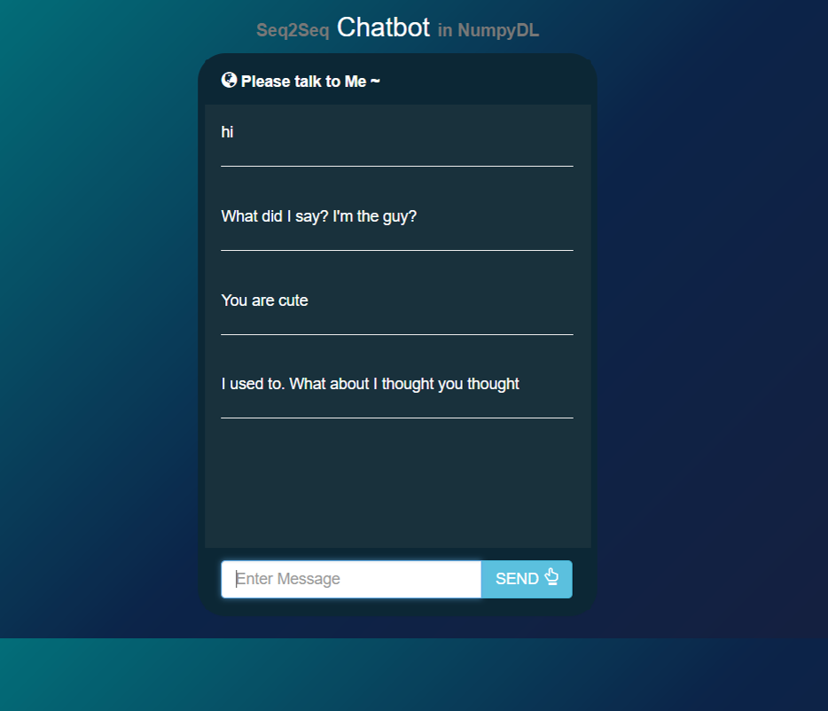

MiKeras: Numpy-based Deep Learning Library
====================================

Descriptions
============

``MiKeras`` is:

1. Based on Pure Numpy/Python
2. For Deep Learning Education

Features
========

Its main features are:

1. *Pure* in Numpy
2. *Native* to Python
3. *Automatic differentiations* are basically supported
4. *Commonly used models* are provided: MLP(multi-layer perceptrons), RNNs, LSTMs and CNNs
5. *Examples* for several AI tasks
6. *Application* for a toy chatbot (based on seq2seq that implemented in MiKeras)

Documentation
=============

Still building...

Installation
============

Install from source code:

.. code-block:: bash

    $> python setup.py install

Examples
========

``MiKeras`` provides several examples of AI tasks:

* sentence classification
    * LSTM in *examples/lstm_sentence_classification.py*
    * CNN in *examples/cnn_sentence_classification.py*
* mnist handwritten recognition
    * MLP in *examples/mlp-mnist.py*
    * MLP in *examples/mlp-digits.py*
    * CNN in *examples/cnn-minist.py*
* language modeling
    * RNN in *examples/rnn-character-lm.py*
    * LSTM in *examples/lstm-character-lm.py*

One concrete code example in *examples/mlp-digits.py*:

.. code-block:: python

    import numpy as np
    from sklearn.datasets import load_digits
    import mikeras

    # prepare
    mikeras.utils.random.set_seed(1234)

    # data
    digits = load_digits()
    X_train = digits.data
    X_train /= np.max(X_train)
    Y_train = digits.target
    n_classes = np.unique(Y_train).size

    # model
    model = mikeras.model.Model()
    model.add(mikeras.layers.Dense(n_out=500, n_in=64, activation=mikeras.activation.ReLU()))
    model.add(mikeras.layers.Dense(n_out=n_classes, activation=mikeras.activation.Softmax()))
    model.compile(loss=mikeras.objectives.SCCE(), optimizer=mikeras.optimizers.SGD(lr=0.005))

    # train
    model.fit(X_train, mikeras.utils.data.one_hot(Y_train), max_iter=150, validation_split=0.1)

Applications
============

``MiKeras`` provides one toy application:

* Chatbot
    * seq2seq in *applications/chatbot/model.py*

And its final result:

Supports
========

``MiKeras`` supports following deep learning techniques:

* Layers
    * Linear
    * Dense
    * Softmax
    * Dropout
    * Convolution
    * Embedding
    * BatchNorm
    * Pooling (Mean,Max)
    * SimpleRNN
    * GRU
    * LSTM
    * Flatten (same idea as in Keras)
    * DimShuffle
* Optimizers
    * SGD
    * Momentum
    * NesterovMomentum
    * Adagrad
    * RMSprop
    * Adadelta
    * Adam
    * Adamax
* Objectives
    * MeanSquaredError
    * HellingerDistance
    * BinaryCrossEntropy
    * SoftmaxCategoricalCrossEntropy
* Initializations
    * Zero
    * One
    * Uniform
    * Normal
    * LecunUniform
    * GlorotUniform
    * GlorotNormal
    * HeNormal
    * HeUniform
    * Orthogonal
* Activations
    * Sigmoid
    * Tanh
    * ReLU
    * Linear
    * Softmax
    * Elliot
    * SymmetricElliot
    * SoftPlus
    * SoftSign

